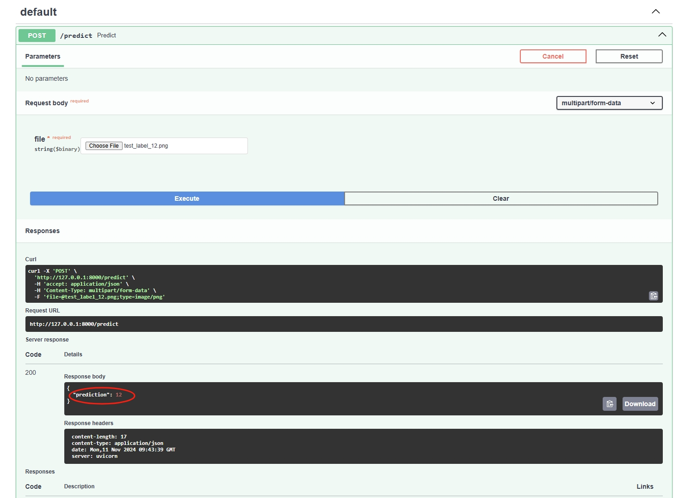
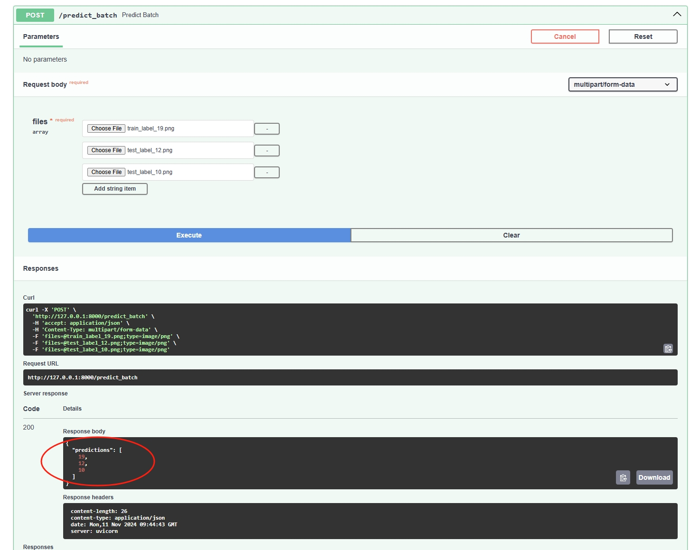

# プロジェクトガイド

## 目次

1. [依存関係のインストールとプログラムの実行](#依存関係のインストールとプログラムの実行)
2. [データセットの処理](#データセットの処理)
3. [モデルの選択](#モデルの選択)
4. [トレーニング](#トレーニング)
5. [Webサーバーの開発](#Webサーバーの開発)

---

### 1. 依存関係のインストールとプログラムの実行

このプロジェクトは Anaconda を使用して開発されています。そのため、Anaconda 環境で requirements.txt` に含まれる依存関係をインストールした後、プログラムを実行することを推奨します。

```bash
# 依存関係のインストール
pip install -r requirements.txt
```

インストールが完了したら、トレーニングの過程を確認したい場合は、training.ipynb を直接実行するか、`training`フォルダに移動して`training.main.py` を実行してください。また、Web サーバーを直接起動したい場合は、`cd app`を実行した後に`uvicorn main:app --reload` コマンドを実行して、`app` ディレクトリ内でサーバーを起動します。

---

### 2. データセットの処理

データセットの前処理には、画像サイズの標準化やデータの正規化が含まれます。また、データ拡張のためにランダム回転やアフィン変換を使用します。データのロードと前処理は以下のように設定されています。また、notebook にはトレーニング集の画像やデータ拡張後の画像を確認するためのセルも含まれています。

トレーニングデータにはデータ拡張を適用しています。予測対象が五十音であることを考慮し、データセットの特徴が不明確になる可能性のある切り取りや反転などの方法は使用せず、ランダムな回転やランダムな平行移動を使用してデータ拡張を行いました。

```python
# データセットの処理コード例
train_transforms = transforms.Compose([
    transforms.RandomRotation(30),
    transforms.RandomAffine(degrees=10, translate=(0.1, 0.1)),
    transforms.ToTensor(),
    transforms.Normalize([0.5], [0.5])
])
```

---

### 3. モデルの選択

トレーニングには SpinalVGG モデルを使用します。これはトレーニング段階および予測段階で使用され、以下のように設定されています。

このモデルの選択にあたって、私は SpinalVGG モデルを採用しました。こちらが論文のリンクです：[https://arxiv.org/pdf/2007.03347](https://arxiv.org/pdf/2007.03347)。

この論文は 2022 年の CVPR で発表されたもので、新しいタイプの VGG モデルを提案しています。このモデルは人間の脊髄の働きを模倣することにより、モデルの精度を向上させ、計算コストを削減することを目的としています。私は、このモデルが Fashion-MNIST や MNIST で優れた成果を上げていることに注目し、本タスクにおいても良い成果を期待できると考えました。

また、このモデルはあまり深くない構造を持っているため、28×28 ピクセルの認識タスクに非常に適しています。過度に深いモデルや Transformer のようなモデルを使用すると、逆に効果が悪くなる可能性があります。

今回のタスクにおいては、精度が最重要ではないものの、機械学習エンジニアとして、各部分で適切な行動を取り、最良の成果を目指すことは非常に重要であると考えています。


---

### 4. トレーニング

同様に、私は Optuna を使用してモデルに最適なハイパーパラメータを探しました。Optuna は、Python で利用できるハイパーパラメータの自動最適化ツールです。ハイパーパラメータの探索と最適化を効率的に行うことで、機械学習モデルの性能向上を図ります。

また、本格的なトレーニング中には学習率の減衰メカニズムを導入し、勾配降下の過程で微細な調整を行い最適なパラメータに到達できるようにしました。さらに、早期停止（Early Stopping）を使用することで、モデルの過学習を防止し、良好なロバスト性と汎化能力を維持することを目指しました。

最終的に、データセットの公式に推奨されたバランスド・アキュラシーにおいて 97.26% の精度を達成しました。また、トレーニング過程での損失と検証集での精度のグラフも提供しており、モデルが非常に良好に収束していることが確認できます。トレーニング結果の評価にはバランスド・アキュラシーを使用します。


---

### 5. Webサーバーの開発

FastAPI を使用して Web サーバーを構築し、モデルの予測をリアルタイムで提供します。サーバーのパフォーマンスと高い同時接続処理能力を確保するために、非同期関数を使用しています。以下の例は、画像のアップロードを受け付け、クラス予測を返すエンドポイントです。

```bash
# Webサーバーの起動
uvicorn app:app --reload
```

サーバーは以下のエンドポイントを提供しています：

- `/predict`: 単一画像のクラス予測
  
- `/predict_batch`: 複数画像のバッチ予測

それぞれのエンドポイントはアップロードされた画像に対してモデルを使用し、クラス予測を返します。


---

このテンプレートを使用して、プロジェクト全体の構成をまとめ、各ステップの詳細な実行手順を確認することができます。

注釈について、私は英語で詳細な注釈を書きました。トレーニングに関する注釈については `.ipynb` ファイルで確認できます。